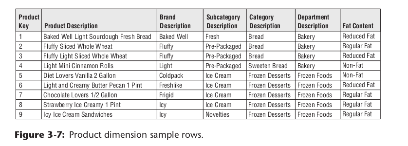

# kimball_the_datawarehouse_toolkit

## Chapter 1 : Data Warehousing, Business Intelligence, and Dimensional Modeling Primer

### Different Worlds of Data Capture and Data Analysis

* Users of operational system typically handeles one transaction at a time and perform actions like taking orders, launching customer complaints, monitoring the system etc, they turn the wheel of organization.
* Users of a DW/BI system, on the other hand, watch the wheels of the organization turn to evaluate performance.

### Goals of Data Warehousing and Business Intelligence

* The DW/BI system must make information easily accessible
* The DW/BI system must present information consistently.
* The DW/BI system must adapt to change.
* The DW/BI system must present information in a timely way.
* The DW/BI system must be a secure bastion that protects the information
assets
* The DW/BI system must serve as the authoritative and trustworthy foun-dation for improved decision making.
* The business community must accept the DW/BI system to deem it successful.

### Dimensional Modeling Introduction
Dimensional modeling is widely accepted as the preferred technique
for presenting analytic data because it addresses two simultaneous requirements:
1. Deliver data that’s understandable to the business users.
2. Deliver fast query performance.


### Star Schemas Versus OLAP Cubes
* A star schema hosted in a relational database is a good physical foundation for building an OLAP cube, and is generally regarded as a more stable basis for backup and recovery.
* OLAP cubes have traditionally been noted for extreme performance advantages over RDBMSs, but that distinction has become less important with advances in computer hardware, such as appliances and in-memory databases, and RDBMS software, such as columnar databases.
* It is typically more diffi cult to port BI applications between diff erent OLAP tools than to port BI applications across different relational databases.
* OLAP cubes off er signifi cantly richer analysis capabilities than RDBMSs, which are saddled by the constraints of SQL. This may be the main justification for using an OLAP product.

### Fact Tables for Measurements ( What is fact tables )
* The fact table in a dimensional model stores the performance measurements resulting from an organization’s business process events.
* The term fact represents a business measure. Imagine standing in the marketplace watching products being sold and writing down the unit quantity and dollar sales amount for each product in each sales transaction. These measurements are captured as products are scanned at the register
* Each row in a fact table corresponds to a measurement event. The data on each row is at a specific level of detail, referred to as the grain
* The most useful facts are numeric and additive, such as dollar sales amount.
* Additivity is crucial because BI applications rarely retrieve a single fact table row. Rather, they bring back hundreds, thousands, or even millions of fact rows at a time, and the most useful thing to do with so many rows is to add them up
* You will see that facts are sometimes semi-additive or even non-additive. Semi-additive facts, such as account balances, cannot be summed across the time dimension. Non-additive facts, such as unit prices, can never be added.
* You should not store redundant textual information in fact tables. Unless the text is unique for every row in the fact table, it belongs in the dimension table
* All fact table grains fall into one of three categories: transaction, periodic snapshot, and accumulating snapshot.

### Dimension Tables for Descriptive Context ( What is dimension tables )
* Dimension tables are integral companions to a fact table. The dimension tables contain the textual context associated with a business process measurement event.
* Dimension **attributes** serve as the primary source of query constraints, groupings, and report labels
* For example, when a user wants to see dollar sales by brand, brand must be available as a dimension attribute
* Attributes should consist of real words rather than cryptic abbreviations. You should strive to minimize the use of codes in dimension tables by replacing them with more verbose textual attributes
* In many ways, the data warehouse is only as good as the dimension attributes; the analytic power of the DW/BI environment is directly proportional to the quality and depth of the dimension attributes.
--------
* it is sometimes unclear whether a numeric data element is a fact or dimension attribute ( price of product )

Note : The designer’s dilemma of whether a numeric quantity is a fact or a dimension attribute is rarely a diffi cult decision. Continuously valued numeric observations are almost always facts; discrete numeric observations drawn from a small list are almost always dimension attributes.

* The hierarchical descriptive information is stored redundantly in the spirit of ease of use and query performance. You should resist the perhaps habitual urge to normalize data by storing only the brand code in the product dimension and creating a separate brand lookup table
* You should almost always trade off dimension table space for simplicity and accessibility.


## Kimball’s DW/BI Architecture
There are four separate and distinct components to
consider in the DW/BI environment: 
1. operational source systems
2. ETL system
3. data presentation area
4. business intelligence applications.

## Alternative DW/BI Architectures

### 1. Independent Data Mart Architecture
* With this approach, analytic data is deployed on a departmental basis without concern to sharing and integrating information across the enterprise
* a single department identifies requirements for data from an operational source system, Working in isolation, this departmental datamart addresses the department’s analytic requirements.
* Meanwhile, another department is interested in the same source data. It’s extremely common for multiple departments to be interested in the same performance metrics resulting from an organization’s core business process events.
* It proceeds down a similar path on its own, obtaining resources and building a departmental solution that contains similar, but slightly different data.
* We strongly discourage the independent data mart approach. However, often these independent data marts have embraced dimensional modeling because they’re interested in delivering data that’s easy for the business to understand and highly responsive to queries.

### 2. Hub-and-Spoke Corporate Information Factory Inmon Architecture
* The final architecture warranting discussion is the marriage of the Kimball and Inmon CIF architectures. This architecture populates a CIF-centric EDW that is completely off limits to business users for analysis and reporting. It’s merely the source to populate a Kimball-esque presentation area in which the data is dimensional, atomic (complemented by aggregates), process centric, and conforms to the enterprise data warehouse bus architecture.

# Kimball DimensionalModeling Techniques Overview

### Collaborative Dimensional Modeling Workshops
* Dimensional models should be designed in collaboration with subject matter experts and data governance representatives from the business. The data modeler is in charge, but the model should unfold via a series of highly interactive workshops with business representatives

### Four-Step Dimensional Design Process
* Select the business process.
* Declare the grain.
* Identify the dimensions.
* Identify the facts

### Business Processes
* Business processes are the operational activities performed by your organization, such as taking an order, processing an insurance claim, registering students for a class, or snapshotting every account each month
* Business process events generate or capture performance metrics that translate into facts in a fact table.

### Grain
* The grain establishes exactly what a single fact table row represents.
* The grain must be declared before choosing dimensions or facts because every candidate dimension or fact must be consistent with the grain.
* Atomic grain refers to the lowest level at which data is captured by a given business process. We strongly encourage you to start by focusing on atomic-grained
* Different grains must not be mixed in the same fact table.

### Dimensions for Descriptive Context
* Dimension tables contain the descriptive attributes
used by BI applications for fi ltering and grouping the facts.

### Facts for Measurements
* Facts are the measurements that result from a business process event and are almost always numeric.

### Star Schemas and OLAP Cubes
* Star schemas are dimensional structures deployed in a relational database management system (RDBMS).
* An online analytical processing (OLAP) cube is a dimensional structure implemented in a multidimensional database; it can be equivalent in content to, or more often derived from, a relational star schema.

## Basic Fact Table Techniques:
* A fact table contains the numeric measures produced by an operational measurement event in the real world.
* In addition to numeric measures, a fact table always contains foreign keys for each of its associated dimensions, as well as optional degenerate dimension keys and date/time stamps.


### Additive, Semi-Additive, Non-Additive Facts
The numeric measures in a fact table fall into three categories. The most fl exible and
useful facts are fully additive;

* additive measures can be summed across any of the dimensions associated with the fact table.
* Semi-additive measures can be summed across some dimensions, but not all. balance amounts are common semi-additive facts because they are additive across all dimensions except time
* Finally, some measures are completely non-additive, such as ratios.
* A good approach for non-additive facts is, where possible, to store the fully additive components of the non-additive measure and sum these components into the fi nal answer set before calculating the fi nal non-additive fact
* This final calculation is often done in the BI layer or OLAP cube.


### Nulls in Fact Tables
* Null-valued measurements behave gracefully in fact tables
* The aggregate functions ( SUM , COUNT , MIN , MAX , and AVG ) all do the “right thing” with null facts.
* However, nulls must be avoided in the fact table’s foreign keys because these nulls would automatically cause a referential integrity violation.
* Rather than a null foreign key, the associated dimension table must have a default row (and surrogate key) representing the unknown or not applicable condition.

### Conformed Facts
* If the same measurement appears in separate fact tables, care must be taken to make sure the technical definitions of the facts are identical, If they are to be compared or computed together.

### Transaction Fact Tables
* A row in a transaction fact table corresponds to a measurement event at a point in space and time.
* Atomic transaction grain fact tables are the most dimensional and expressive fact tables;

### Periodic Snapshot Fact Tables
* A row in a periodic snapshot fact table summarizes many measurement events occurring over a standard period ( day, a week, or a month )
* The grain is the period, not the individual transaction
* These fact tables are uniformly dense in their foreign keys because even if no activity takes place during the period, a row is typically inserted in the fact table containing a zero or null for each fact.

### Accumulating Snapshot Fact Tables
* A row in an accumulating snapshot fact table summarizes the measurement events occurring at predictable steps between the beginning and the end of a process.
* such as order fulfi llment or claim processing, that have a defined start point, standard intermediate steps, and defined end point can be modeled with this type of fact table.
* An individual row in an accumulating snapshot fact table, corresponding for instance to a line on an order, is initially inserted when the order line is created.
* As pipeline progress occurs, the accumulating fact table row is revisited and updated.

### Factless Fact Tables
* Although most measurement events capture numerical results, it is possible that the event merely records a set of dimensional entities coming together at a moment in time. For example, an event of a student attending a class on a given day may not have a recorded numeric fact, but a fact row with foreign keys for calendar day,student, teacher, location, and class is well defined. 
* Likewise, customer communications are events, but there may be no associated metrics. Factless fact tables can also be used to analyze what didn’t happen. 
* These queries always have two parts: a factless coverage table that contains all the possibilities of events that might happen and an activity table that contains the events that did happen. When the activity is subtracted from the coverage, the result is the set of events that did not happen.

### Aggregate Fact Tables or OLAP Cubes
Aggregate fact tables are simple numeric rollups of atomic fact table data built solely to accelerate query performance.

### Consolidated Fact Tables
* It is often convenient to combine facts from multiple processes together into a single consolidated fact table if they can be expressed at the same grain.
* For example, sales actuals can be consolidated with sales forecasts in a single fact table to make the task of analyzing actuals versus forecasts simple and fast

## Basic Dimension Table Techniques
The techniques in this section apply to all dimension tables. Dimension tables are
discussed and illustrated in every chapter.

### Dimension Table Structure
* Dimension tables are usually wide, flat denormalized tables with many low-cardinality text attributes.
* Dimension table attributes are the primary target of constraints and grouping specifications from queries and BI applications. The descriptive labels on reports are typically dimension attribute domain values.

### Dimension Surrogate Keys
* A dimension table is designed with one column serving as a unique primary key.
* This primary key cannot be the operational system’s natural key because there will be multiple dimension rows for that natural key when changes are tracked over time.

### Natural, Durable, and Supernatural Keys
* Natural keys created by operational source systems are subject to business rules outside the control of the DW/BI system. For instance, an employee number (natural key) may be changed if the employee resigns and then is rehired.
* When the data warehouse wants to have a single key for that employee, a new durable key must be created that is persistent and does not change in this situation
* This key is sometimes referred to as a durable supernatural key.

### Degenerate Dimensions
* Sometimes a dimension is defi ned that has no content except for its primary key
* For example, when an invoice has multiple line items, the line item fact rows inherit all the descriptive dimension foreign keys of the invoice, and the invoice is left with no unique content.
* But the invoice number remains a valid dimension key for fact tables at the line item level.
* This degenerate dimension is placed in the fact table with the explicit acknowledgment that there is no associated dimension table.
* Degenerate dimensions are most common with transaction and accumulating snapshot fact tables.

### Multiple Hierarchies in Dimensions
* Many dimensions contain more than one natural hierarchy. For example, calendar date dimensions may have a day to week to fi scal period hierarchy, as well as a day to month to year hierarchy. Location intensive dimensions may have multiple geographic hierarchies. In all of these cases, the separate hierarchies can gracefully coexist in the same dimension table.

### Flags and Indicators as Textual Attributes
* Cryptic abbreviations, true/false fl ags, and operational indicators should be supplemented in dimension tables with full text words that have meaning when independently viewed.
* Operational codes with embedded meaning within the code value should be broken down with each part of the code expanded into its own separate descriptive dimension attribute.

### Null Attributes in Dimensions
Null-valued dimension attributes result when a given dimension row has not been fully populated, or when there are attributes that are not applicable to all the dimension’s rows. In both cases, we recommend substituting a descriptive string, such as
Unknown or Not Applicable in place of the null value. Nulls in dimension attributes should be avoided because diff erent databases handle grouping and constraining on nulls inconsistently.

### Calendar Date Dimensions
Calendar date dimensions are attached to virtually every fact table to allow navigation of the fact table through familiar dates, months, fiscal periods, and special days on the calendar. You would never want to compute Easter in SQL, but rather want to look it up in the calendar date dimension. The calendar date dimension typically
has many attributes describing characteristics such as week number, month name, fiscal period, and national holiday indicator.

### Role-Playing Dimensions
A single physical dimension can be referenced multiple times in a fact table, with
each reference linking to a logically distinct role for the dimension. For instance, a
fact table can have several dates, each of which is represented by a foreign key to the
date dimension. It is essential that each foreign key refers to a separate view of
the date dimension so that the references are independent. These separate dimen-
sion views (with unique attribute column names) are called roles.

### Outrigger Dimensions
A dimension can contain a reference to another dimension table. For instance, a bank account dimension can reference a separate dimension representing the date the account was opened. These secondary dimension references are called outrigger dimensions.


## Integration via Conformed Dimensions
One of the marquee successes of the dimensional modeling approach has been to define a simple but powerful recipe for integrating data from different business processes.

### Conformed Dimensions
* Dimension tables conform when attributes in separate dimension tables have the same column names and domain contents.
* When a conformed attribute is used as the row header (that is, the grouping column in the SQL query), the results from the separate fact tables can be aligned on the same rows in a drill-across report.
* e.g. Time is confirmed dimension ( common dimension ) which can be used on HR as well as Finance datamart. 
* This is the essence of integration in an enterprise DW/BI system. Conformed dimensions, defined once in collaboration with the business’s data governance representatives, are reused across fact tables; they deliver both analytic consistency and reduced future development costs because the wheel is not repeatedly re-created.

### Shrunken Dimensions

* Shrunken dimensions are conformed dimensions that are a subset of rows and/or columns of a base dimension.
* Shrunken rollup dimensions are required when constructing aggregate fact tables. They are also necessary for business processes that naturally capture data at a higher level of granularity, such as a forecast by month and brand (instead of the more atomic date and product associated with sales data).
* Another case of conformed dimension subsetting occurs when two dimensions are at the same level of detail, but one represents only a subset of rows.

**Wordings from IBM.com**
* A shrunken dimension entity is a perfect subset of a more detailed, granular dimension entity. 
* In this case, the attributes that are common to both the detailed and shrunken subset dimension have the same attribute names, definitions, and domain values.


### Drilling Across
* Drilling across simply means making separate queries against two or more fact tables where the row headers of each query consist of identical conformed attributes. The answer sets from the two queries are aligned by performing a sort-merge operation on the common dimension attribute row headers. BI tool vendors refer to this functionality by various names, including stitch and multipass query.

### Value Chain

### Enterprise Data Warehouse Bus Architecture
* The enterprise data warehouse bus architecture provides an incremental approach to building the enterprise DW/BI system.
* This architecture decomposes the DW/ BI planning process into manageable pieces by focusing on business processes, while delivering integration via standardized conformed dimensions that are reused across processes.
* It provides an architectural framework, while also decomposing the program to encourage manageable agile implementations corresponding to the rows on the enterprise data warehouse bus matrix.
* The bus architecture is technology and database platform independent; both relational and OLAP dimensional structures can participate.

### Enterprise Data Warehouse Bus Matrix
* The enterprise data warehouse bus matrix is the essential tool for designing and communicating the enterprise data warehouse bus architecture
* The rows of the matrix are business processes and the columns are dimensions
* The shaded cells of the matrix indicate whether a dimension is associated with a given business process.
* The design team scans each row to test whether a candidate dimension is well-defi ned for the business process and also scans each column to see where a dimension should be conformed across multiple business processes.
* Besides the technical design considerations, the bus matrix is used as input to prioritize DW/BI projects with business management as teams should implement one row of the matrix at a time.


### Detailed Implementation Bus Matrix
* The detailed implementation bus matrix is a more granular bus matrix where each business process row has been expanded to show specifi c fact tables or OLAP cubes.
* At this level of detail, the precise grain statement and list of facts can be documented.

## Dealing with Slowly Changing Dimension Attributes
**Type 0: Retain Original**
With type 0, the dimension attribute value never changes, so facts are always grouped by this original value.

**Type 1: Overwrite**
With type 1, the old attribute value in the dimension row is overwritten with the new value; type 1 attributes always refl ects the most recent assignment, and therefore this technique destroys history

**Type 2: Add New Row**
* Type 2 changes add a new row in the dimension with the updated attribute values.
* This requires generalizing the primary key of the dimension beyond the natural or durable key because there will potentially be multiple rows describing each member.
* A minimum of three additional columns should be added to the dimension row with type 2 changes: 1) row eff ective date or date/time stamp; 2) row expiration date or date/time stamp; and 3) current row indicator.

**Type 3: Add New Attribute** 
* Type 3 changes add a new attribute in the dimension to preserve the old attribute value; the new value overwrites the main attribute as in a type 1 change. 
* This kind of type 3 change is sometimes called an alternate reality. A business user can group and filter fact data by either the current value or alternate reality. 
* This slowly changing dimension technique is used relatively infrequently.

**Type 4: Add Mini-Dimension**
* The type 4 technique is used when a group of attributes in a dimension rapidly changes and is split off to a mini-dimension. 
* This situation is sometimes called a rapidly changing monster dimension. 
* Frequently used attributes in multimillion-row dimension tables are mini-dimension design candidates, even if they don’t frequently change. 
* The type 4 mini-dimension requires its own unique primary key; the primary keys of both the base dimension and mini dimension are captured in the associated fact tables.

Add explanation with solid case to justify this.

**Type 5: Add Mini-Dimension and Type 1 Outrigger**
**Type 6: Add Type 1 Attributes to Type 2 Dimension** 
**Type 7: Dual Type 1 and Type 2 Dimensions**

## Dealing with Dimension Hierarchies

### Fixed Depth Positional Hierarchies
* A fixed depth hierarchy is a series of **many-to-one** relationships
* such as product to brand to category to department

### Slightly Ragged/Variable Depth Hierarchies
* Slightly ragged hierarchies don’t have a fi xed number of levels, but the range in depth is small.
* Geographic hierarchies often range in depth from perhaps three levels to six levels.
* Rather than using the complex machinery for unpredictably variable hierarchies, you can force-fi t slightly ragged hierarchies into a fi xed depth positional design with separate dimension attributes for the maximum number of levels, and then populate the attribute value based on rules from the business.

### Ragged/Variable Depth Hierarchies with Hierarchy Bridge Tables
* Ragged hierarchies of indeterminate depth are difficult to model and query in a relational database.
* The bridge table contains a row for every possible path in the ragged hierarchy and enables all forms of hierarchy traversal to be accomplished with standard SQL


### Ragged/Variable Depth Hierarchies with Pathstring Attributes
* The use of a bridge table for ragged variable depth hierarchies can be avoided by implementing a pathstring attribute in the dimension. For each row in the dimension, the pathstring attribute contains a specially encoded text string containing the complete path description from the supreme node of a hierarchy down to the node described by the particular dimension row.

## Advanced Fact Table Techniques

### Fact Table Surrogate Keys
* Fact table surrogate keys, which are not associated with any dimension, are assigned sequentially during the ETL load process and are used  1) as the single column primary key of the fact table; 2) to serve as an immediate identifi er of a fact table row without navigating multiple dimensions for ETL purposes; 3) to allow an interrupted load process to either back out or resume; 4) to allow fact table update operations to be decomposed into less risky inserts plus deletes.

### Centipede Fact Tables
Some designers create separate normalized dimensions for each level of a many-to-one hierarchy, such as a date dimension, month dimension, quarter dimension, and year dimension, and then include all these foreign keys in a fact table. This results in a centipede fact table with dozens of hierarchically related dimensions. Centipede
fact tables should be avoided.

### Numeric Values as Attributes or Facts
Designers sometimes encounter numeric values that don’t clearly fall into either the fact or dimension attribute categories. A classic example is a product’s standard list price. If the numeric value is used primarily for calculation purposes, it likely belongs in the fact table. If a stable numeric value is used predominantly for fi ltering and grouping, it should be treated as a dimension attribute; the discrete numeric values can be supplemented with value band attributes (such as $0-50). In some cases, it is useful to model the numeric value as both a fact and dimension attribute, such as a quantitative on-time delivery metric and qualitative textual descriptor.

### Lag/Duration Facts
Accumulating snapshot fact tables capture multiple process milestones, each with a date foreign key and possibly a date/time stamp. Business users often want to analyze the lags or durations between these milestones; sometimes these lags are just the diff erences between dates, but other times the lags are based on more complicated business rules. If there are dozens of steps in a pipeline, there could be hundreds of possible lags. Rather than forcing the user’s query to calculate each possible lag from the date/time stamps or date dimension foreign keys, just one time lag can be
stored for each step measured against the process’s start point. Then every possible lag between two steps can be calculated as a simple subtraction between the two lags stored in the fact table.

### Header/Line Fact Tables
Operational transaction systems often consist of a transaction header row that’s associated with multiple transaction lines. With header/line schemas (also known as parent/child schemas), all the header-level dimension foreign keys and degenerate dimensions should be included on the line-level fact table.

### Allocated Facts
It is quite common in header/line transaction data to encounter facts of differing granularity, such as a header freight charge. You should strive to allocate the header facts down to the line level based on rules provided by the business, so the allocated facts can be sliced and rolled up by all the dimensions. In many cases, you can avoid creating a header-level fact table, unless this aggregation delivers query performance advantages.

### Profit and Loss Fact Tables Using Allocations
* Fact tables that expose the full equation of profi t are among the most powerful deliverables of an enterprise DW/BI system. 
* The equation of profit is (revenue) – (costs) = (profit). 
* Fact tables ideally implement the profit equation at the grain of the atomic revenue transaction and contain many components of cost. * * Because these tables are at the atomic grain, numerous rollups are possible, including customer profi tability, product profitability, promotion profitability, channel profitability, and others.

### Multiple Currency Facts
Some business processes require facts to be stated simultaneously in several units of measure. For example, depending on the perspective of the business user, a supply chain may need to report the same facts as pallets, ship cases, retail cases, or individual scan units. If the fact table contains a large number of facts, each of which must be expressed in all units of measure, a convenient technique is to store the facts once in the table at an agreed standard unit of measure, but also simultaneously store conversion factors between the standard measure and all the others.
This fact table could be deployed through views to each user constituency, using an appropriate selected conversion factor. The conversion factors must reside in the underlying fact table row to ensure the view calculation is simple and correct, while minimizing query complexity.

### Year-to-Date Facts
Do not implement this.

### Timespan Tracking in Fact Tables
* There are three basic fact table grains: transaction, periodic snapshot, and accumulating snapshot.
* In isolated cases, it is useful to add a row eff ective date, row expiration date, and current row indicator to the fact table, much like you do with type 2 slowly changing dimensions, to capture a timespan when the fact row was effective. Although an unusual pattern, this pattern addresses scenarios such as slowly changing inventory balances where a frequent periodic snapshot would load identical rows with each snapshot.

### Late Arriving Facts
* A fact row is late arriving if the most current dimensional context for new fact rows does not match the incoming row. 
* This happens when the fact row is delayed. In this case, the relevant dimensions must be searched to find the dimension keys that were effective when the late arriving measurement event occurred.

## Advanced Dimension Techniques

### Dimension-to-Dimension Table Joins
* Dimensions can contain references to other dimensions. 
* Although these relation ships can be modeled with outrigger dimensions, in some cases, the existence of a foreign key to the outrigger dimension in the base dimension can result in explosive growth of the base dimension because type 2 changes in the outrigger force corresponding type 2 processing in the base dimension.
* This explosive growth can often be avoided if you demote the correlation between dimensions by placing the foreign key of the outrigger in the fact table rather than in the base dimension. This means the correlation between the dimensions can be discovered only by traversing the fact table, but this may be acceptable, especially if the fact table is a periodic snapshot where all the keys for all the dimensions are guaranteed to be present for each reporting period.

### Multivalued Dimensions and Bridge Tables
* In a classic dimensional schema, each dimension attached to a fact table has a single value consistent with the fact table’s grain.
* But there are a number of situations in which a dimension is legitimately multivalued.
* For example, a patient receiving a healthcare treatment may have multiple simultaneous diagnoses.
* In these cases, the multivalued dimension must be attached to the fact table through a group dimension key to a bridge table with one row for each simultaneous diagnosis in a group.

### Time Varying Multivalued Bridge Tables
* A multivalued bridge table may need to be based on a type 2 slowly changing dimension. For example, the bridge table that implements the many-to-many relationship between bank accounts and individual customers usually must be based on type 2 account and customer dimensions. In this case, to prevent incorrect linkages between accounts and customers, the bridge table must include effective and expiration date/time stamps, and the requesting application must constrain the bridge table to a specific moment in time to produce a consistent snapshot.

### Behavior Tag Time Series
Almost all text in a data warehouse is descriptive text in dimension tables. Data mining customer cluster analyses typically results in textual behavior tags, often identified on a periodic basis. In this case, the customers behavior measurements over time become a sequence of these behavior tags; this time series should be stored as positional attributes in the customer dimension, along with an optional text string for the complete sequence of tags. The behavior tags are modeled in a positional design because the behavior tags are the target of complex simultaneous queries rather than numeric computations.

### Aggregated Facts as Dimension Attributes
* Business users are often interested in constraining the customer dimension based on aggregated performance metrics, such as fi ltering on all customers who spent over a certain dollar amount during last year or perhaps over the customer’s lifetime.
* Selected aggregated facts can be placed in a dimension as targets for constraining and as row labels for reporting. The metrics are often presented as banded ranges in the dimension table. Dimension attributes representing aggregated performance metrics add burden to the ETL processing, but ease the analytic burden in the BI layer.

### Dynamic Value Bands
A dynamic value banding report is organized as a series of report row headers that define a progressive set of varying-sized ranges of a target numeric fact. 
For instance, a common value banding report in a bank has many rows with labels such as “Balance from 0 to $10,” “Balance from $10.01 to $25,” and so on. 
This kind of report is dynamic because the specific row headers are defi ned at query time, not
during the ETL processing. The row definitions can be implemented in a small value banding dimension table that is joined via greater-than/less-than joins to the fact table, or the definitions can exist only in an SQL CASE statement. 
The value banding dimension approach is probably higher performing, especially in a columnar database, because the CASE statement approach involves an almost unconstrained relation scan of the fact table.

### Text Comments Dimension
Rather than treating freeform comments as textual metrics in a fact table, they should be stored outside the fact table in a separate comments dimension (or as attributes in a dimension with one row per transaction if the comments’ cardinality matches the number of unique transactions) with a corresponding foreign key in the fact table.


### Multiple Time Zones
To capture both universal standard time, as well as local times in multi-time zone applications, dual foreign keys should be placed in the aff ected fact tables that join to two role-playing date (and potentially time-of-day) dimension tables.

### Measure Type Dimensions
Sometimes when a fact table has a long list of facts that is sparsely populated in any individual row, it is tempting to create a measure type dimension that collapses the fact table row down to a single generic fact identifi ed by the measure type dimension. We generally do not recommend this approach.

### Step Dimensions
Sequential processes, such as web page events, normally have a separate row in a transaction fact table for each step in a process. To tell where the individual step fits into the overall session, a step dimension is used that shows what step number is represented by the current step and how many more steps were required to complete the session.

### Hot Swappable Dimensions
Hot swappable dimensions are used when the same fact table is alternatively paired with different copies of the same dimension. For example, a single fact table containing stock ticker quotes could be simultaneously exposed to multiple separate investors, each of whom has unique and proprietary attributes assigned to different
stocks.

### Abstract Generic Dimensions
Some modelers are attracted to abstract generic dimensions. For example, their schemas include a single generic location dimension rather than embedded geographic attributes in the store, warehouse, and customer dimensions.
Similarly, their person dimension includes rows for employees, customers, and vendor contacts because they are all human beings, regardless that significantly diff erent attributes are collected for each type. Abstract generic dimensions should be avoided in dimensional models. The attribute sets associated with each type often differ. If the attributes are common, such as a geographic state, then they should be uniquely labeled to distinguish a store’s state from a customer’s. Finally, dumping all varieties of locations, people, or products into a single dimension invariably results in
a larger dimension table.

### Audit Dimensions
* When a fact table row is created in the ETL back room, it is helpful to create an audit dimension containing the ETL processing metadata known at the time.
* Useful audit dimension attributes could include environment variables describing the versions of ETL code used to create the fact rows or the ETL process execution time stamps.
* These environment variables are especially useful for compliance and auditing purposes because they enable BI tools to drill down to determine which rows were created with what versions of the ETL software.

### Late Arriving Dimensions
* Sometimes the facts from an operational business process arrive minutes, hours, days, or weeks before the associated dimension context. For example, in a real-time data delivery situation, an inventory depletion row may arrive showing the natural key of a customer committing to purchase a particular product. In a real-time ETL system, this row must be posted to the BI layer, even if the identity of the customer or product cannot be immediately determined. In these cases, special dimension rows are created with the unresolved natural keys as attributes. 
* Of course, these dimension rows must contain generic unknown values for most of the descriptive columns; presumably the proper dimensional context will follow from the source at a later time. When this dimensional context is eventually supplied, the placeholder dimension rows are updated with type 1 overwrites. 
* Late arriving dimension data also occurs when retroactive changes are made to type 2 dimension attributes. In this case, a new row needs to be inserted in the dimension table, and then the associated fact rows must be restated.

# Chapter 3: Retail Sales

## Four-Step Dimensional Design Process
Throughout this book, we will approach the design of a dimensional model by consistently considering four steps, as the following sections discuss in more detail.

### Step 1: Select the Business Process
* Business processes are frequently expressed as action verbs because they represent activities that the business performs.
* Business processes are typically supported by an operational system, such as the billing or purchasing system.
* It’s also worth noting what a business process is not. Organizational business departments or functions do not equate to business processes. By focusing on processes, rather than on functional departments, consistent information is delivered more economically throughout the organization. If you design departmentally bound dimensional models, you inevitably duplicate data with different labels and data values. The best way to ensure consistency is to publish the data once.

### Step 2: Declare the Grain
Declaring the grain means specifying exactly what an individual fact table row represent 

**Example grain declarations include:**

* One row per scan of an individual product on a customer’s sales transaction
* One row per line item on a bill from a doctor
* One row per individual boarding pass scanned at an airport gate
* One row per daily snapshot of the inventory levels for each item in a warehouse
* One row per bank account each month

If the grain isn’t clearly defi ned, the whole design rests on
quicksand;
An inappropriate grain haunts a DW/BI implementation!
It is extremely important that everyone on the design team reaches agreement on the fact table’s granularity. Having said this, you may discover in steps 3 or 4 of the design process that the grain statement is wrong. This is okay, but then you must return to step 2, restate the grain correctly, and revisit steps 3 and 4 again.

### Step 3: Identify the Dimensions
After the grain of the fact table has been chosen, the choice of dimensions is straight forward. The product and transaction fall out immediately. Within the framework of the primary dimensions, you can ask whether other dimensions can be attributed to the POS measurements, such as the date of the sale, the store where the sale
occurred, the promotion under which the product is sold, the cashier who handled the sale, and potentially the method of payment. We express this as another design principle.

### Step 4: Identify the Facts
* The facts must be true to the grain: the individual product line item on the POS transaction in this case. 
* When considering potential facts, you may again discover adjustments need to be made to either your earlier grain assumptions or choice of dimensions.
* The facts collected by the POS system include the sales quantity (for example, the number of cans of chicken noodle soup), per unit regular, discount, and net paid prices, and extended discount and sales dollar amounts. The extended sales dollar amount equals the sales quantity multiplied by the net unit price. Likewise, the extended discount dollar amount is the sales quantity multiplied by the unit discount amount. Some sophisticated POS systems also provide a standard dollar cost for the product as delivered to the store by the vendor. Presuming this cost fact is readily available and doesn’t require a heroic activity-based costing initiative,

## Dimension Table Details

### Date Dimension
The date dimension is a special dimension because it is the one dimension nearly guaranteed to be in every dimensional model since virtually every business process captures a time series of performance metrics. In fact, date is usually the first dimension in the underlying partitioning scheme of the database so that the successive time interval data loads are placed into virgin territory on the disk.

```
Note: Dimensional models always need an explicit date dimension table. There are many date attributes not supported by the SQL date function, including week numbers, fiscal periods, seasons, holidays, and weekends. Rather than attempting to determine these nonstandard calendar calculations in a query, you should look them up in a date dimension table.
```
### Flags and Indicators as Textual Attributes

Like many operational flags and indicators, the date dimension’s holiday indicator is a simple indicator with two potential values. Because dimension table attributes serve as report labels and values in pull-down query filter lists, this indicator should
be populated with meaningful values such as Holiday or Non-holiday instead of the cryptic Y/N, 1/0, or True/False

### Time-of-Day as a Dimension or Fact
Although date and time are comingled in an operational date/time stamp, time-of-day is typically separated from the date dimension to avoid a row count explosion in the date dimension

### Product Dimension
The product dimension describes every SKU in the grocery store.

### Flatten Many-to-One Hierarchies
* The product dimension represents the many descriptive attributes of each SKU. The merchandise hierarchy is an important group of attributes.
* SKU ---> Brand --> Categories --> Department.

```
Note: Keeping the repeated low cardinality values in the primary dimension table is a fundamental dimensional modeling technique. Normalizing these values into separate tables defeats the primary goals of simplicity and performance, as discussed in “Resisting Normalization Urges” later in this chapter.
```



### Store Dimension
* The store dimension is the case study's primary geographic dimension. Each store can be thought of as a location.
* Stores likely also roll up an internal organization hierarchy consisting of store districts and regions.
 ### DATES WITHIN DIMENSION TABLES

* The first open date and last remodel date in the store dimension could be date type columns. However, if users want to group and constrain on nonstandard calendar attributes (like the open date's fiscal period), then they are typically join keys to copies of the date dimension table.
* 

## Promotion Dimension
* The various possible causal conditions are highly correlated. A temporary price reduction usually is associated with an ad and perhaps an end aisle display.
* For this reason, it makes sense to create one row in the promotion dimension for each combination of promotion conditions that occurs.
* Over the course of a year, there may be 1,000 ads, 5,000 temporary price reductions, and 1,000 end aisle displays, but there may be only 10,000 combinations of these three conditions affecting any particular product.

on the other hand, The trade-offs in favor of separating the causal mechanisms into four distinct dimension tables include the following:

* The separated dimensions may be more understandable to the business community if users think of these mechanisms separately. This would be revealed during the business requirement interviews.
* Administration of the separate dimensions may be more straightforward than administering a combined dimension.

### NULL FOREIGN KEYS, ATTRIBUTES, AND FACTS
You must avoid null keys in the fact table. A proper design includes a row in the corresponding dimension table to identify that the dimension is not applicable to the measurement.

* We sometimes encounter nulls as dimension attribute values. These usually result when a given dimension row has not been fully populated, or when there are attributes that are not applicable to all the dimension's rows. In either case, we recommend substituting a descriptive string, such as Unknown or Not Applicable,
* 

TBD .. The notes in between this passage

### Factless Fact Tables
* What products were on promotion but did not sell?
* In the relational world, a promotion coverage or event fact table is needed to answer the question concerning what didn't happen.
* The promotion coverage fact table keys would be date, product, store, and promotion
* We refer to it as a factless fact table because it has no measurement metrics;
* First, you'd query the promotion factless fact table to determine the universe of products that were on promotion on a given day.
* You'd then determine what products sold from the POS sales fact table. The answer to our original question is the set difference between these two lists of products. 


### Degenerate Dimension Surrogate Keys
* Although surrogate keys aren't typically assigned to degenerate dimensions, each situation needs to be evaluated to determine if one is required.
* A surrogate key is necessary if the transaction control numbers are not unique across locations or get reused. For example, the retailer's POS system may not assign unique transaction numbers across stores.
* You may need to assign a surrogate key (and create an associated dimension table)
*  Obviously, control number dimensions modeled in this way with corresponding dimension tables are no longer degenerate.

